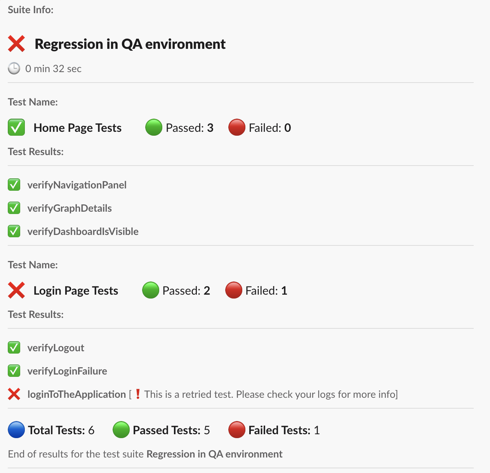

# Automated Test Results to Your Slack

A Java library to send automated test results as a notification to slack. All you need is to add this library as a dependency in your project.

## Features

- Supports Web, Mobile and API test automation
- Supports TestNG framework (Cucumber is in progress)
- Provides fail/pass info on suite, test, class and method level
- Notifies if a test is retried - pass or fail
- Provides test duration info on suite and test level
- Provides branch details where the tests are executed

## Prerequisites

 - Slack webhook URL - see this [link](https://api.slack.com/messaging/webhooks#create_a_webhook) on how to get one
 - TestNG v7.0.0 and above

### Maven Dependency:

```xml
<dependency>
  <groupId>io.github.automationreddy</groupId>
  <artifactId>java-slack-notify</artifactId>
  <version>1.1.0</version>
</dependency>
```

### Gradle

```gradle
implementation group: 'io.github.automationreddy', name: 'java-slack-notify', version: '1.1.0'
```

## Usage

1. Create `slack.properties` file and keep in your `src/main/resources` folder
2. Add the following keys and values to it `WEBHOOK_URL=<Webhook URL>` and `NOTIFY_ONLY_ON_FAILURE=true or false`
3. If you want to include the branch name where your tests are executed, you can do so by adding BRANCH_NAME and BRANCH_LINK as runtime variables. Make sure to add both variables
```html
//If you are using maven, pass the arguments as below:
-DBRANCH_NAME=test-branch -DBRANCH_LINK=https://github.com
```
4. Add the `TestNGSlackReporter` listener either to the test class or in the `testng.xml` file (Cucumber support is in progress)

#### Adding listener at class level

```java
@Listeners(TestNGSlackReporter.class)
public class TestClass {
  //ToDo
 }
```

#### Adding listener in testng.xml

```xml
<?xml version="1.0" encoding="UTF-8"?>
<!DOCTYPE suite SYSTEM "http://testng.org/testng-1.0.dtd">
<suite name="Regression">
    <listeners>
        <listener class-name="io.github.automationreddy.testng.TestNGSlackReporter"/>
    </listeners>
</suite>

```
## How it works

After the test execution is done, reporter will build the message and send notification based on the user input and test pass/fail status

## Options

### WEBHOOK_URL

Slack webhook url 

Type: `String` <br/>
Optional: `NO` <br/>
Default: `NA`

### NOTIFY_ONLY_ON_FAILURE

Based on this option, notification will be sent. If this is true, notification will only be sent when the test is failed. Otherwise, it sends irrespective of the test status

Type: `String` <br/>
Optional: `YES` <br/>
Default: `false`

## Screenshot



## Limitations

### TestNG
- It doesn't support the versions older than v7.0.0
- It doesn't support multiple suite files as below
```xml
<suite name="allSuites">
  <suite-files>
    <suite-file path="suite1.xml" />
    <suite-file path="suite2.xml" />
    ...
  </suite-files>
</suite>
```
