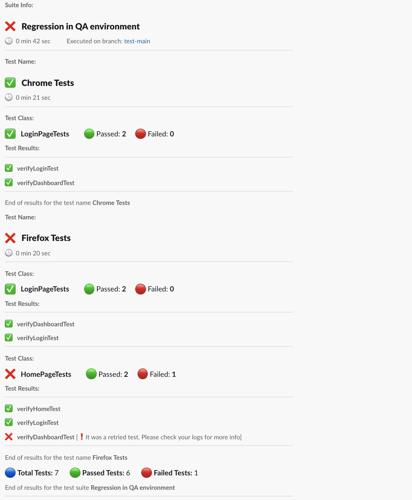

# Automated Test Results to Your Slack

A Java library to send automated test results as a notification to slack. All you need is to add this library as a dependency in your project.

## Prerequisites

 - Slack webhook URL - see this [link](https://api.slack.com/messaging/webhooks#create_a_webhook) on how to get one

#### This library now only supports the TestNG framework. (Cucumber support will be added soon). This can be used in mobile, web and api automation frameworks.

### Maven Dependency:

```xml
<dependency>
  <groupId>io.github.automationreddy</groupId>
  <artifactId>java-slack-notify</artifactId>
  <version>1.0.0</version>
</dependency>
```

### Gradle

```gradle
implementation group: 'io.github.automationreddy', name: 'java-slack-notify', version: '1.0.0'
```

## Usage

1. Create `slack.properties` file and keep in your `src/main/resources` folder
2. Add the following keys and values to it `WEBHOOK_URL=<Webhook URL>` and `NOTIFY_ONLY_ON_FAILURE=true or false`
3. Add the `TestNGReporter` listener either to the test class or in the `testng.xml` file (Cucumber support is in progress)

#### Adding listener at class level

```java
@Listeners(TestNGReporter.class)
public class TestClass {
  //ToDo
 }
```

#### Adding listener in testng.xml

```xml
<?xml version="1.0" encoding="UTF-8"?>
<!DOCTYPE suite SYSTEM "http://testng.org/testng-1.0.dtd">
<suite name="Regression">
    <listeners>
        <listener class-name="io.github.automationreddy.TestNGReporter"/>
    </listeners>
</suite>

```
## How it works

After the test execution is done, reporter will build the message and send notification based on the user input and test pass/fail status

## Options

### WEBHOOK_URL

Slack webhook url 

Type: `String` <br/>
Optional: `NO` <br/>
Default: `NA`

### NOTIFY_ONLY_ON_FAILURE

Based on this option, notification will be sent. If this is true, notification will only be sent when the test is failed. Otherwise, it sends irrespective of the test status

Type: `String` <br/>
Optional: `YES` <br/>
Default: `false`

## Screenshot



